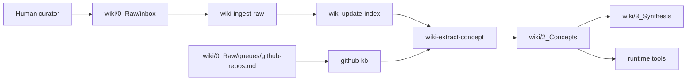

# Agent-Driven Personal Knowledge Base

A local, Agent-maintained personal knowledge base.

The human curates sources and asks questions. The Agent handles ingestion, indexing, concept extraction, synthesis, graph inspection, and maintenance.

## What This Is

Use this repository as your working Personal Knowledge Base. The default structure starts empty except for examples, so the first step is to add your own profile, taxonomy, and sources.

The system is designed so:

- raw materials enter through `wiki/0_Raw/inbox/`
- Agent Skills move sources through a YAML state machine
- reusable insights become evergreen concept cards in `wiki/2_Concepts/`
- cross-concept analysis is saved in `wiki/3_Synthesis/`
- local scripts retrieve context packs and graph health signals
- optional GitHub project research flows through `github-kb/`

## Architecture



## Documentation Index

- [Quick Start](./QUICK_START.md) — dependencies, environment checks, Codex integration, and smoke tests
- [Quick Start 中文版](./QUICK_START.zh-CN.md)
- [Chinese README](./README.zh-CN.md)
- [Agent Instructions](./AGENTS.md)
- [Claude Code Instructions](./CLAUDE.md)
- [GitHub KB subsystem](./github-kb/README.md)
- [Runtime tools](./wiki/4_Tools/runtime/README.md)

`AGENTS.md` and `CLAUDE.md` are mirrors. Keep them semantically identical whenever you update Agent operating rules.

## Quick Start Summary

For the full setup flow, use [QUICK_START.md](./QUICK_START.md).

Minimal path:

1. Copy `config/user_profile.example.md` to `USER.md`.
2. Copy `config/taxonomy.example.yaml` to `config/taxonomy.yaml`.
3. Drop Markdown, PDFs, images, or clipped URLs into `wiki/0_Raw/inbox/`.
4. Ask your Agent to run the pipeline:

```text
全流程
```

Or run individual Skill stages:

```text
/wiki-ingest-raw
/wiki-update-index
/wiki-extract-concept
/wiki-synthesize-report
/wiki-lint
/personal-kb-agent
```

## Directory Layout

```text
.
├── AGENTS.md
├── CLAUDE.md
├── config/
├── .agents/skills/
├── .claude/skills/
├── wiki/
│   ├── 0_Raw/
│   ├── 1_Index/
│   ├── 2_Concepts/
│   ├── 3_Synthesis/
│   └── 4_Tools/runtime/
└── github-kb/
```

## Privacy Model

This repository is meant to become personal once configured. Treat these files as private after you start using it.

Keep private:

- `USER.md`
- real source material under `wiki/0_Raw/`
- real concept cards under `wiki/2_Concepts/`
- real synthesis reports under `wiki/3_Synthesis/`
- `wiki/log.md`
- real `github-kb/INDEX.md` and `github-kb/MEMORY.md`
- screenshots, PDFs, clipped articles, and attachments

If you later share the system publicly, create a clean copy that contains only examples, placeholders, and generic operating rules.

## License

This repository includes an MIT License by default. Adjust it if your private usage or sharing model requires different terms.
