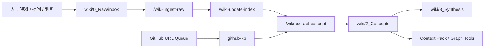

# Agent-Driven Personal Knowledge Base

一个本地运行的 **Agent 驱动个人知识库**。

人的职责是喂料、提问、判断价值；Agent 的职责是整理、索引、提炼、综合、巡检和维护知识资产。

初始仓库只包含示例、占位文件和通用规则。第一次使用时，你需要填入自己的用户画像、分类体系和资料来源；从那之后，它就会逐步变成你的私人知识库。

## 它解决什么问题

传统个人知识库容易变成“收藏夹坟场”：资料进来了，但没有被结构化、复用，也很少形成稳定洞察。

这个系统把知识库交给 Agent 维护：

- 新资料统一进入 `wiki/0_Raw/inbox/`
- 每个文件通过 YAML 状态机流转，避免重复处理
- 有长期价值的内容被提炼成 `wiki/2_Concepts/` 概念卡
- 跨概念分析沉淀到 `wiki/3_Synthesis/`
- 本地脚本提供 context pack 和知识图谱健康检查
- GitHub 项目研究可以通过 `github-kb/` 独立入库

## 总体架构



## 目录结构

```text
.
├── AGENTS.md                    # Agent 执行规则与路由
├── CLAUDE.md                    # Claude Code 兼容入口
├── config/
│   ├── taxonomy.example.yaml    # 分类体系示例
│   ├── user_profile.example.md  # 私人画像模板，不要公开填写后的 USER.md
│   └── agent_policy.example.yaml
├── .agents/skills/              # 通用 Agent Skill
├── .claude/skills/              # Claude Code Skill 镜像
├── wiki/
│   ├── 0_Raw/                   # 原始资料入口、归档、队列、审核
│   ├── 1_Index/                 # 索引与知识地图
│   ├── 2_Concepts/              # 常青概念卡
│   ├── 3_Synthesis/             # 综合报告与决策分析
│   └── 4_Tools/runtime/         # 本地检索与图谱脚本
└── github-kb/                   # 可选：GitHub 项目研究子系统
```

## 文档索引

- [QUICK_START.zh-CN.md](./QUICK_START.zh-CN.md)：中文快速开始，包含依赖、环境检查、Codex 集成与测试流程
- [QUICK_START.md](./QUICK_START.md)：英文快速开始
- [AGENTS.md](./AGENTS.md)：Agent 执行规则与 Skill 路由
- [CLAUDE.md](./CLAUDE.md)：Claude Code 入口，必须与 `AGENTS.md` 语义一致
- [github-kb/README.md](./github-kb/README.md)：GitHub 项目研究子系统
- [wiki/4_Tools/runtime/README.md](./wiki/4_Tools/runtime/README.md)：本地检索与图谱工具

`AGENTS.md` 和 `CLAUDE.md` 是镜像文件。更新 Agent 规则时，两者必须保持语义一致。

## 快速开始摘要

完整流程见 [QUICK_START.md](./QUICK_START.md)。这里保留最短路径：

### 1. 初始化你的私人配置

复制用户画像模板：

```bash
cp config/user_profile.example.md USER.md
```

然后在 `USER.md` 中写入你的背景、长期目标、关注主题和协作偏好。这个文件应当保持私有，不要提交到任何共享副本。

复制并修改分类体系：

```bash
cp config/taxonomy.example.yaml config/taxonomy.yaml
```

你可以使用默认的五类，也可以改成自己的分类，例如研究、工程、产品、写作、生活系统等。

### 2. 投喂资料

把 Markdown、PDF、截图、剪藏文章放入：

```text
wiki/0_Raw/inbox/
```

如果是 GitHub 仓库 URL，放入：

```text
wiki/0_Raw/queues/github-repos.md
```

### 3. 让 Agent 跑管线

在支持本仓库规则的 Agent 环境中，可以直接说：

```text
全流程
```

也可以分阶段执行：

```text
/wiki-ingest-raw
/wiki-update-index
/wiki-extract-concept
/wiki-synthesize-report
/wiki-lint
/personal-kb-agent
/github-kb-indexer
```

## 核心状态机

每个被处理的 Markdown 文件都应带有 frontmatter：

```yaml
---
status: raw-ingested | indexed | conceptualized | extracted
source: <original URI or local path>
---
```

流转方式：

```text
inbox -> raw-ingested -> indexed -> extracted -> archive
                              \
                               -> conceptualized concept cards
```

含义：

- `raw-ingested`：资料已解析并初步分析
- `indexed`：资料已挂到索引或知识地图
- `conceptualized`：概念卡状态，用于 `wiki/2_Concepts/`
- `extracted`：源资料已完成概念提炼，可归档但不删除

## Skill 说明

| Skill | 作用 |
|---|---|
| `/wiki-ingest-raw` | 处理 inbox 原始资料，做初步分析和防腐校验 |
| `/wiki-update-index` | 将资料挂入 `master_index.md` 或主题索引 |
| `/wiki-extract-concept` | 把可复用洞察提炼成常青概念卡 |
| `/wiki-synthesize-report` | 基于概念库生成专题报告或阶段总结 |
| `/wiki-lint` | 检查孤儿页、缺失引用、陈旧声明、覆盖空白 |
| `/personal-kb-agent` | 只读检索知识库，生成 context pack 或图谱洞察 |
| `/github-kb-indexer` | 消费 GitHub URL 队列，沉淀项目级启发 |

## Runtime 工具

生成查询上下文：

```bash
python3 wiki/4_Tools/runtime/search/kb_context_pack.py "agent memory" --top 8
```

检查概念图谱：

```bash
python3 wiki/4_Tools/runtime/graph/kb_graph_insights.py
```

这些工具默认只读，适合给通用 Agent 组装上下文。

## 隐私边界

完成第一次配置后，这个仓库会开始承载你的私人知识资产。默认应把工作中的 vault 当作私有仓库处理。

如果未来要分享给别人，建议另做一份干净副本，只保留：

- 通用规则
- Skill 定义
- runtime 工具
- 示例配置
- 虚构示例概念卡

以下内容必须保持私有：

- `USER.md`
- 真实 `wiki/0_Raw/`
- 真实 `wiki/2_Concepts/`
- 真实 `wiki/3_Synthesis/`
- `wiki/log.md`
- 真实 `github-kb/INDEX.md` / `MEMORY.md`
- 截图、PDF、剪藏文章、个人策略与研究结论

## 设计原则

- **Agent 维护，不是人肉整理**：人负责判断价值，Agent 负责繁琐 bookkeeping。
- **源资料不丢失**：概念提炼后，原始证据仍保存在 archive。
- **状态机保证幂等**：同一批资料可以被多次扫描而不重复处理。
- **概念层追求可复用**：`2_Concepts/` 不是摘要堆积，而是长期可调用的思想节点。
- **综合报告少而重**：`3_Synthesis/` 用于沉淀跨概念推理、决策依据和阶段性报告。
- **先本地，后远程**：优先让本地 Skill 和脚本跑通，再考虑 MCP 或服务化。

## License

默认包含 MIT License。你可以根据自己的使用或分享方式调整。
