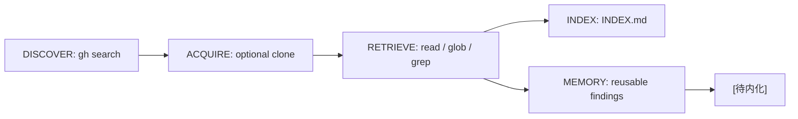

# GitHub Knowledge Base

Turn GitHub repositories into a searchable, ownable local knowledge subsystem.

## Core Rules

```text
correctness > fluency
verification > persuasion
explicit evidence > guessed summaries
```

If information is missing, mark it as `UNKNOWN` and say what evidence would resolve it.

## Configuration

```yaml
kb_root: ./github-kb/repos/
index_file: INDEX.md
focus_file: FOCUS.md
memory_file: MEMORY.md
```

## Commands

| Command | Purpose |
|---|---|
| `/search-github <query>` | Search GitHub repositories, issues, or PRs |
| `/clone-repo <owner/repo>` | Clone a confirmed repository into `repos/` |
| `/update-catalog [repo]` | Update local catalog entries |

## Workflow



## Index Entry Template

```markdown
#### [owner/repo](https://github.com/owner/repo)

- GitHub: https://github.com/owner/repo
- Local: not cloned
- Category: agent-framework
- Status: LATER
- Why it matters: <one sentence>
- Notes: <one or two verified notes>
```

## Memory Entry Template

```markdown
- <Project-agnostic finding that can become a concept card.> [待内化]
```

## Safety

- Do not fabricate project features.
- Do not overwrite `INDEX.md` or `MEMORY.md`; append or update targeted entries.
- Do not mass clone repositories.
- Ask before cloning.
- Keep `repos/` out of public exports.
