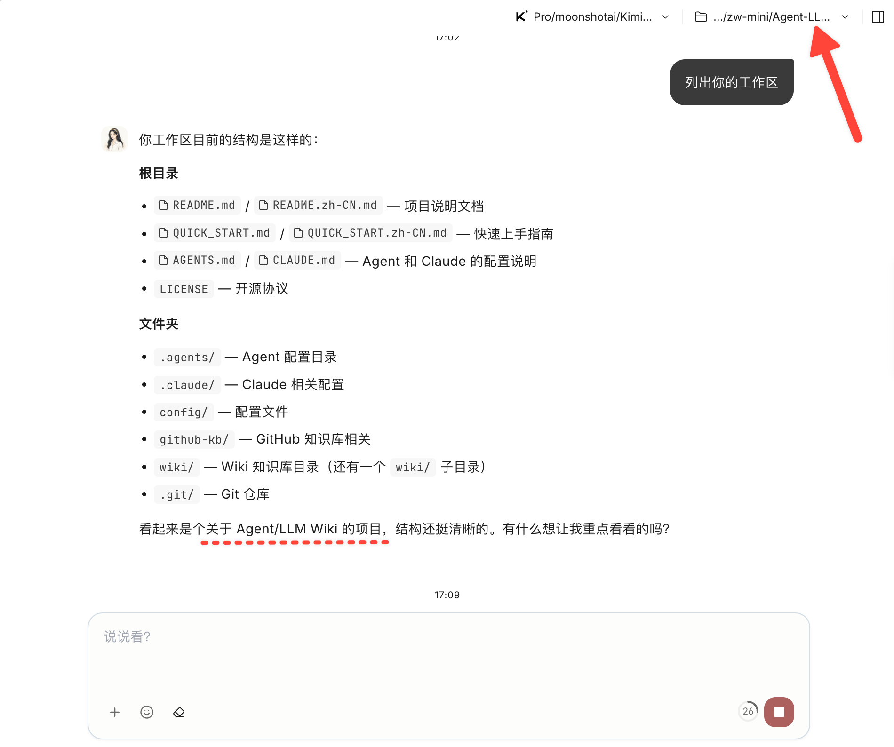
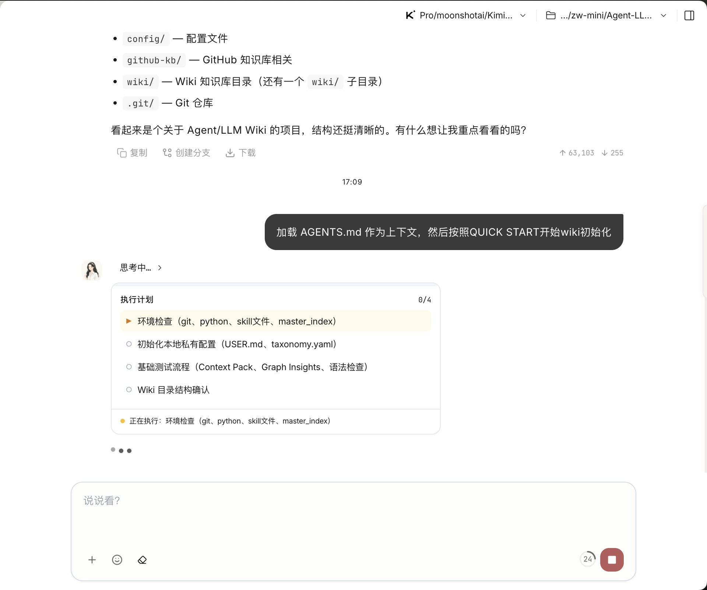
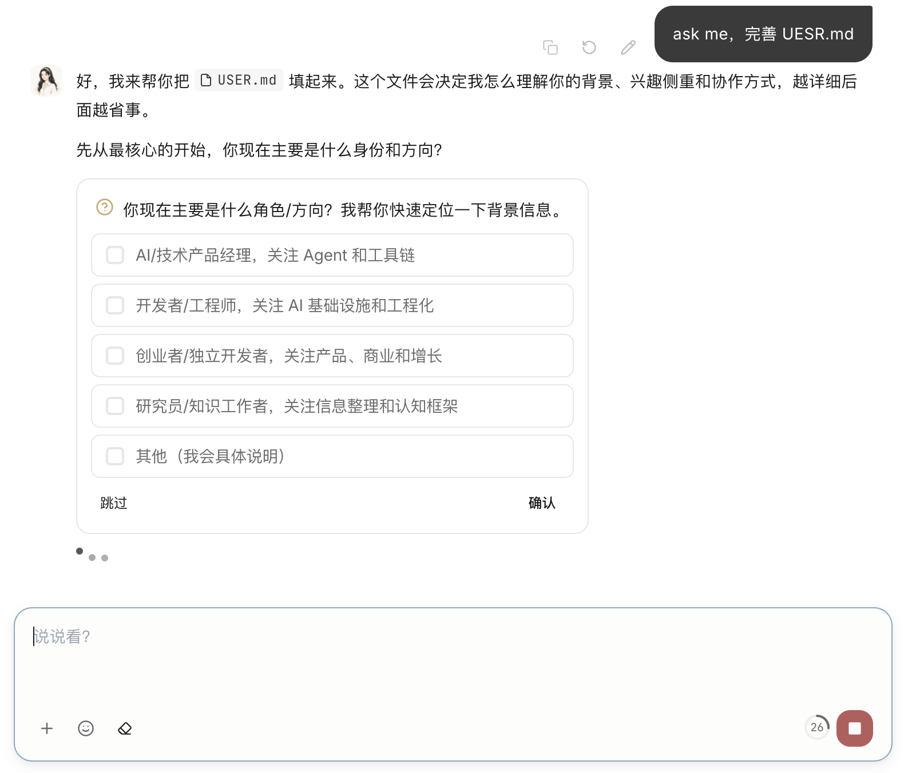
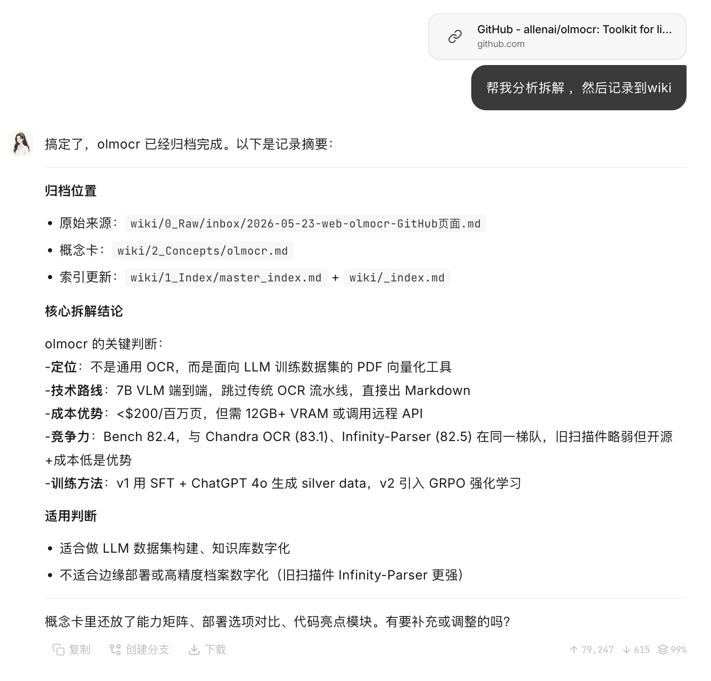

# 给 Alice 添加外挂大脑  
#   
1. ****修改工作区，指向 ++[Agent-LLM-Wiki](https://github.com/zhiweiofli/Agent-LLM-Wiki) ++****  
#   
  
2. **第一次手动引导 Alice 加载 agents 作为上下文（codex / claude 等ide会自动加载）**  
  
#   
  
3. 如果上述流程没有触发初始化流程，可以试试显示引导  
  
  
4. 测试  
  
