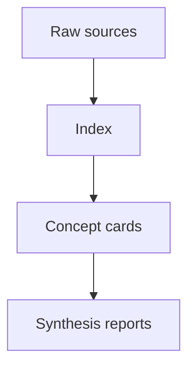

# Master Index

This file maps the major dimensions of your knowledge base. Replace these example sections with the dimensions in `config/taxonomy.yaml`.

## AI Engineering

| Topic | Concept / Source | Status |
|---|---|---|
| Agent workflow state machine | [[Example_Agent_Workflow_State_Machine]] | conceptualized |

## Knowledge Systems

| Topic | Concept / Source | Status |
|---|---|---|
| Agent-maintained wiki pattern | [[Example_Agent_Workflow_State_Machine]] | conceptualized |

## Knowledge Map

