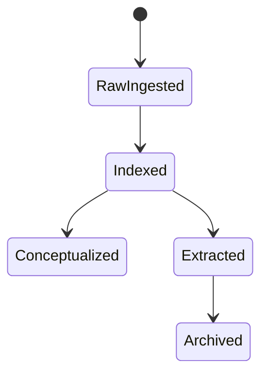

# Example Agent Workflow State Machine

## Core Insight

An Agent-maintained knowledge base becomes reliable when every source moves through explicit states instead of being rewritten ad hoc.

## Mechanism

## When To Use

- use this pattern when multiple Agent runs may process the same vault asynchronously
- use it when preserving evidence matters
- avoid it for throwaway scratch notes

## Related Concepts

- Add related concept links here as the vault grows.

## Source Reference

<- Source reference: [[master_index]]
